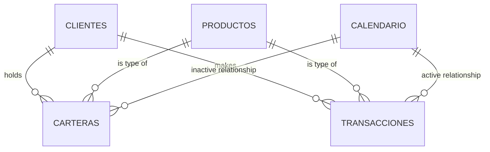
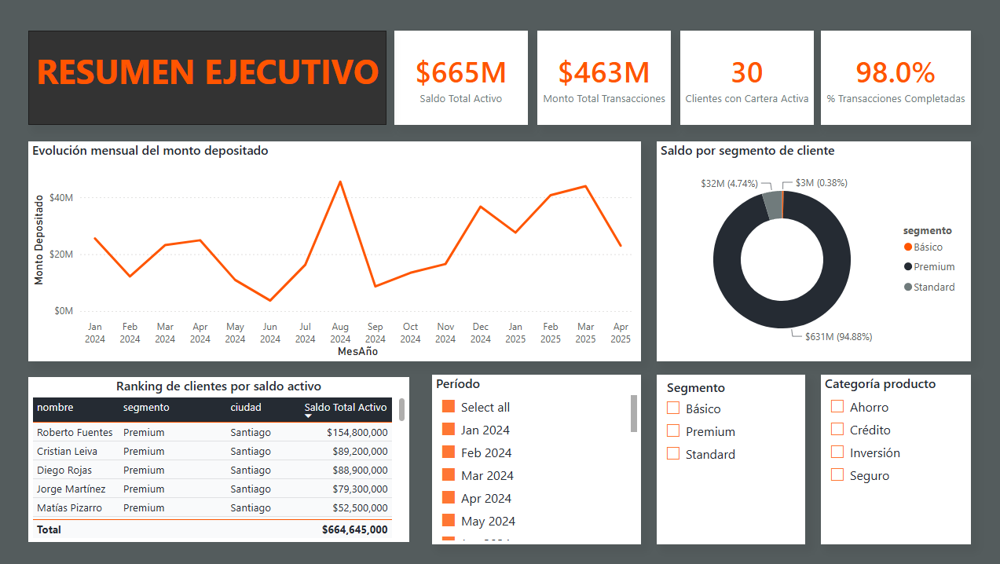
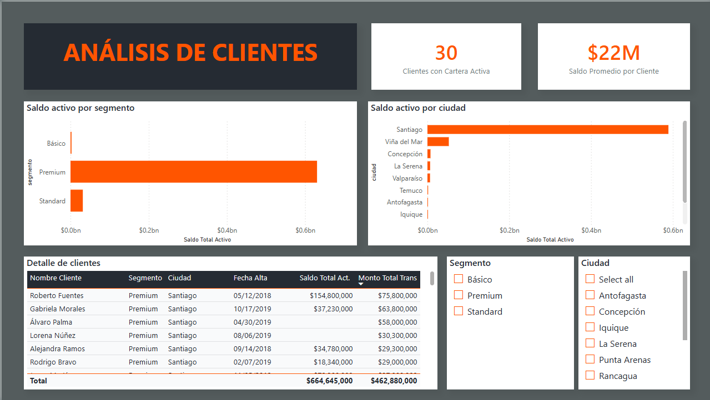
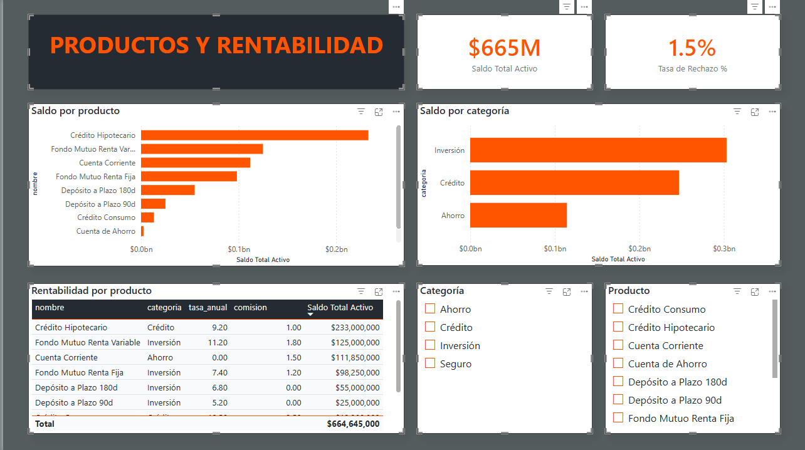

# Retail Banking Analytics — SQL + Power BI Case Study

End-to-end analytics case study on a synthetic retail banking dataset: from raw PostgreSQL tables to an 8-query SQL analysis and a 3-page Power BI executive dashboard.

**Stack:** PostgreSQL 16 · DAX · Power BI (PBIP / TMDL) · window functions · CTEs

---

## 1. Business context

A retail bank needs a monthly view of customer behavior, portfolio risk, and product profitability for its leadership committee. The raw data lives in four normalized tables — customers, products, transactions, and portfolio holdings — and the goal is to turn it into decision-ready SQL answers and a self-service dashboard.

This is a personal case study built to practice the full analyst workflow: data modeling, advanced SQL, DAX measure design, and dashboard storytelling — not a client deliverable. Company names, recipient details, and any identifying references have been removed; the underlying data is fully synthetic.

## 2. Data model



Two fact tables (`transacciones`, `carteras`) share two dimensions (`clientes`, `productos`) — a common pattern in transactional + holdings banking data. A dedicated `Calendario` table (DAX `CALENDAR()`) governs all time intelligence, with one **active** relationship to `transacciones.fecha` and **inactive** relationships to the portfolio open/close dates and customer signup date, switchable via `USERELATIONSHIP` when needed.

Table and column names are kept in Spanish, matching the original schema; all documentation, comments, and analysis are in English.

## 3. SQL analysis — [`sql/banking_analytics_queries.sql`](sql/banking_analytics_queries.sql)

Eight business questions, each solved and validated against the live data before being finalized:

| # | Question | Technique |
|---|---|---|
| 1 | Monthly transacted amount by type | `DATE_TRUNC`, half-open date range (sargable) |
| 2 | Top 10 customers by active-portfolio balance | Inner `JOIN` with filter in the `ON` clause |
| 3 | Customers holding 2+ distinct products | `COUNT(DISTINCT ...)` + `HAVING` |
| 4 | Top 3 customers per segment by completed deposits | `RANK() OVER (PARTITION BY ...)` |
| 5 | Customers "at risk" (active credit + high withdrawal ratio) | Multi-CTE aggregation, rolling date anchor |
| 6 | Rejection rate by transaction type | `FILTER (WHERE ...)`, `HAVING COUNT(*) > 5` |
| 7 | Profitability by product (balance, income, yield) | `LEFT JOIN` with filter in `ON` to preserve zero-holding products |
| 8 | Month-over-month deposit growth | `LAG() OVER (ORDER BY ...)` |

**A deliberate design decision worth calling out:** Query 5 returns zero rows. Rather than treating that as a dead end, the script includes a full sensitivity-analysis appendix that traces *why* — of the customers holding an active credit product, none has a withdrawal history anywhere near the 50% risk threshold, even without the 6-month window. An empty result set without that diagnosis looks like a bug; with it, it demonstrates the query is correct and the data simply contains no positive cases.

All date-scoped queries anchor "recent" to `MAX(fecha)` in the table rather than `CURRENT_DATE`, so the script stays reproducible regardless of when it's re-run.

## 4. Power BI dashboard

Connected directly to PostgreSQL in Import mode — no intermediate CSV export.

**9 explicit DAX measures**, grouped in a dedicated `_Medidas` table:

| Measure | Logic |
|---|---|
| Total Transaction Amount | `SUM(transacciones[monto])` |
| Active Total Balance | `CALCULATE(SUM(carteras[saldo_actual]), carteras[fecha_cierre] = BLANK())` |
| Average Balance per Customer | `AVERAGEX(VALUES(clientes[cliente_id]), [Active Total Balance])` |
| Deposited Amount | `CALCULATE(SUM(transacciones[monto]), transacciones[tipo] = "Depósito")` |
| Deposited Amount, Prior Month | `CALCULATE([Deposited Amount], DATEADD(Calendario[Fecha], -1, MONTH))` |
| Monthly Deposit Growth % | `DIVIDE([Deposited Amount] - [Deposited Amount, Prior Month], [Deposited Amount, Prior Month])` |
| % Completed Transactions | `DIVIDE(CALCULATE(COUNTROWS(...), estado = "Completada"), COUNTROWS(...))` |
| Rejection Rate % | Same pattern, filtered on `estado = "Rechazada"` |
| Customers with Active Portfolio | `CALCULATE(DISTINCTCOUNT(carteras[cliente_id]), fecha_cierre = BLANK())` |

**3 pages, 24 visuals total:**

### Executive Summary
KPI cards, monthly deposit trend, balance-by-segment breakdown, top-customer ranking, and period/segment/category slicers.



### Customer Analysis
Segment and city breakdowns, full customer detail table with balance and transaction totals.



### Products & Profitability
Balance and estimated income by product and category, full profitability table.



## 5. Key findings

- **Customer base is heavily concentrated.** The top 10 customers by balance are 100% Premium-segment, 80% based in a single city. The Premium segment moves roughly 144× the transaction volume of the entry-level segment — a concentration risk worth flagging to the committee.
- **4 of 12 products have zero active holdings**, including the highest-commission product in the catalog. That's an unexploited commercial gap, visible directly in the profitability table (LEFT JOIN keeps them in view instead of hiding them).
- **Rejections are isolated to a single transaction type.** Deposits, withdrawals, and transfers show 0% rejection; the entire 11.1% rejection rate is concentrated in one type — a signal to investigate a specific process, not a systemic issue.

## 6. Reproducing this project

```bash
createdb bankinganalytics
psql -d bankinganalytics -f schema_and_seed.sql   # not included — synthetic data generator
psql -d bankinganalytics -f sql/banking_analytics_queries.sql
```

Then in Power BI Desktop: **Get Data → PostgreSQL database → localhost:5432 → Import mode**, select the 4 tables, and the model/measures described above.

---

*Part of my [data analytics portfolio](https://github.com/chelo000777/portfolio). See also: [5G NR User Segmentation](../) and [Telecom Network Swap Dashboard](../) for HiveSQL/Big Data and telecom-domain examples.*
