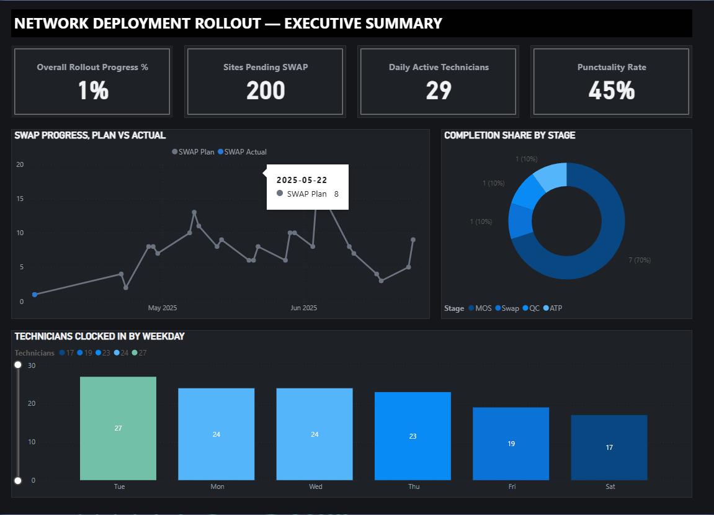
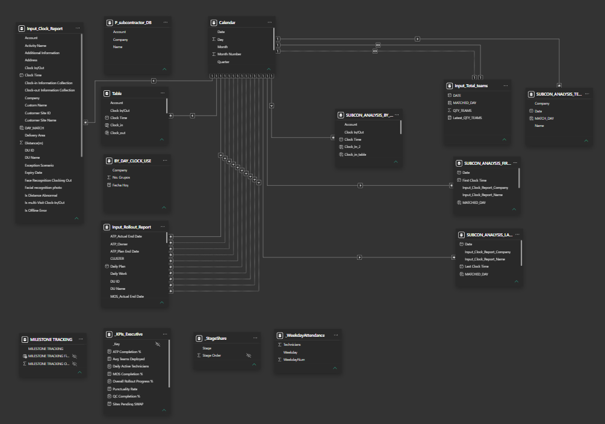

# Network Swap Rollout Dashboard (Power BI)

Executive tracking model for a telecom network-swap rollout: it turns raw
subcontractor clock-in/out logs and milestone plan/actual dates into a
rollout-progress and field-attendance dashboard.

Built while managing subcontractor teams executing a multi-stage swap
project (site prep, equipment swap, QC, acceptance testing, reverse
logistics) for a telecom operator in Bolivia. Company names, site names,
and identifying details in this published version are anonymized;
the analytical logic and DAX are exactly as used in production.

## What it does

- Tracks 5 rollout stages per site (MOS, Swap, QC, ATP, Reverse Logistics),
  each with a **planned** and **actual** completion date
- Rolls those into stage-level and overall **completion %** and **on-time %**
- Parses subcontractor clock-in/out timestamps into daily attendance,
  punctuality, and technician headcount
- Surfaces sites that are delayed or pending, and which teams are behind

## Data model

See [`model/data_model.dbml`](model/data_model.dbml) for the full schema.
Rendered ERD: paste the DBML into [dbdiagram.io](https://dbdiagram.io).

Core tables:
- `Input_Rollout_Report` — one row per site, plan/actual date for each of
  5 rollout stages
- `Input_Clock_Report` — raw clock-in/out events per technician per site
- `Input_Total_teams` — daily headcount of active field teams
- `Calendar` — standard date table driving all time intelligence
- Several calculated tables (`SUBCON_ANALYSIS_*`, `BY_DAY_CLOCK_USE`,
  `P_subcontractor_DB`) derive attendance and roster views from the raw
  clock data without duplicating it

## Key measures

See [`measures/DAX_measures.md`](measures/DAX_measures.md) for the full
list. Highlights:

- `Overall Rollout Progress %` — actuals completed across all 5 stages,
  divided by everything planned
- `SWAP Completion %`, `QC Completion %`, `ATP Completion %`, `MOS Completion %`
- `SWAP On-Time Rate` — actual completion at or before plan date
- `Daily Active Technicians` — distinct technicians clocked in
- `Punctuality Rate` — share of clock-ins before the 9:30 cutoff
- `Sites Pending SWAP` — plan minus actual, i.e. remaining backlog

These live in a dedicated `_KPIs_Executive` measures table so they're easy
to find in the field list and don't clutter the input tables.

## Dashboard

An executive summary page in the Power BI report itself: KPI cards
(rollout progress, sites pending, active technicians, punctuality),
a plan-vs-actual swap trend, a completion-share donut by rollout stage,
and a weekday technician-attendance bar chart — dark themed to match
the preview below.

See [`preview/dashboard_preview.html`](preview/dashboard_preview.html)
for a standalone HTML preview (sample data — open directly in a browser
or embed via GitHub Pages). The live Power BI report link is in my
[portfolio index](https://github.com/chelo000777/portfolio).

## Screenshots

**Executive dashboard**

**Data model**

## Tools

Power BI (Power Query, DAX, PBIP project format), modeled in Power BI
Desktop. Sanitized company/site/employee names throughout; see
`model/data_model.dbml` for the generic column and table names used.

## Author

Juan Marcelo Párraga Calizaya — [LinkedIn](https://linkedin.com/in/marcelo-parraga) · [Portfolio](https://github.com/chelo000777/portfolio)
